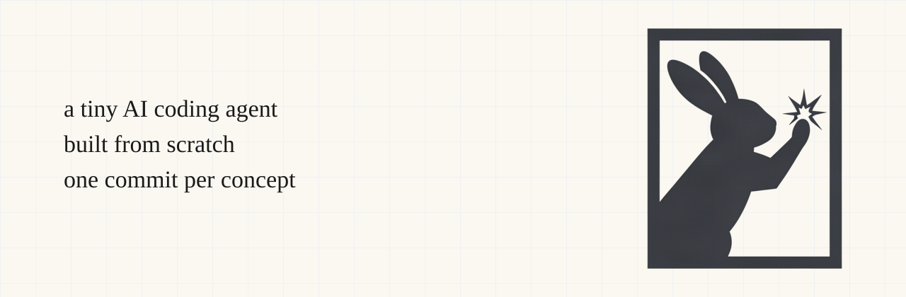

<p align="center">
  
</p>

# petite-harness

A tiny AI coding agent, built from scratch, one commit per concept.

Read the git history top to bottom to see a Claude-Code-like assistant emerge from a 40-line script: LLM calls, tool calling, the agent loop, skills.

## Stages

- [x] 1. Talk to an LLM — prompt in, response out, no tools, no loop
- [x] 2. Read tool — model requests a file, you execute and return it
- [x] 3. Write tool — same, for writing files
- [x] 4. Agent loop — keep looping until the model stops requesting tools
- [x] 5. Bash tool — same, for shell commands
- [x] 6. Extract tools module — dispatch table instead of `if/elif` soup
- [x] 7. Tool classes with Pydantic — schema + validation from one model per tool
- [ ] 8. Skills (level 1) — advertise `.claude/skills/*/SKILL.md` name + description
- [ ] 9. Slash commands (level 2) — load a skill's full body on demand
- [ ] 10. Skill classes — same idea as stage 7, applied to skills
- [ ] 11. Tests — fake LLM client, no real API calls

## Running it

```bash
uv sync
export OPENROUTER_API_KEY=sk-or-v1-...
uv run main.py -p "What does this project do?"
```

Any OpenAI-compatible endpoint works — override `OPENROUTER_BASE_URL` / `MODEL`.

Free models: https://openrouter.ai/models?q=free&output_modalities=text (slugs change — a 404 means pick a new one).

## Why

Most "build your own agent" content either hides the hard parts behind a framework, or dumps a finished repo on you. Here every commit is small enough to read in two minutes.

## References

- [Claude Code tools reference](https://code.claude.com/docs/en/tools-reference) — the real tool set (`Read`, `Write`, `Edit`, `Bash`, `Glob`, `Grep`...) this project is inspired by, scaled down to teachable size.
- [OpenRouter quickstart](https://openrouter.ai/docs/quickstart#using-the-openrouter-api) — the OpenAI-compatible API this project talks to by default.
